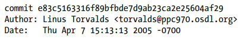
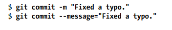
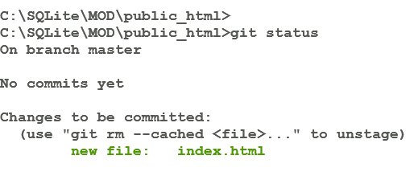

# Control de Versiones (Git gestiona el cambio)

### Introducción: 
Una herramienta que administra y rastrea diferentes versiones de software u otro contenido se conoce como un _sistema de control de versiones_ (VCS). Un VCS se encarga de desarrollar y mantener un repositorio de contenido, proporcionando acceso a ediciones historicas de cada dato y registrar todos los cambios. 
Git es una herramienta de control de versiones particularmente potente, flexible y de bajo costo. Git fue inventado por __Linus Torvalds__ para apoyar en el desarrollo del kernel de Linux. 
Git apodado cariñosamente por su creador como "el gestor de información del infierno".

### ¿Por qué Git?

1. Facilidad de desarrollo distribuido.
2. Integridad y confianza.
3. Inmutabilidad.

### Linea del tiempo
Git cobro vida en abril 2005. Se puede corroborar con este primer commit: 

La interpretación global más popular para Git es (Global Information Tracker), que sería algo como "Rastreador de Información Global".

Usar Git es sencillo, solo tenemos que escribir en el prom __git__

### Los comandos de Linea más usados:
- __add__: Agrega el contenido del archivo al indice.
- __branch__: Enumera, crea o elimina ramas.
- __clone__: Clonar un reporsitorio en un nuevo directorio.
- __commit__: Registra los cambios en el repositorio.
- __init__: Crea un repositorio de Git vacío o reinicializa uno existente.
- __log__: Muestra los registros de confirmación.
- __pull__: Extraer o fusionar un reporsitorio.
- __push__: Actualiza referencias remotas junto con objetos asociados.
- __reset__: Restablece el HEAD actual al estado especificado.
- __status__: Muestra el estado actual del árbol de trabajo.
- __--help --all__ : Muestra la ayuda de todos los comandos.

### Comandos cortos y largos:

Los comandos en Git comprenden las opciones tanto cortas como largas. Verbigracia, ambos son iguales:

La forma corta __-m__ usa solamente un guión, mientras que la larga __--message__ usa dos.

### Creando e Inicializando un Repositorio

1. Creamos nuestro directorio y el archivo index.html

     
        > mkdir .\public_html
        > cd ./public_html
        > echo "My website is alive!" > index.html

2. Inicializamos nuestro directorio en __git__

         > git init

Git no diferencia si el directorio inicializado esta lleno o vacío. En cualquier caso el proceso de convertir un directorio en un repositorio de Git es el mismo. Para indicar que el directorio es un repositorio de Git, se crea un directorio oculto llamado .git en el nivel superior del proyecto. 

3. Adición de un archivo al indice (stage).

        > git add index.html

Inicialmente cada repositorio de Git está vacío. Para administrar el el contenido se debe depositar explicitamente en el repositorio. El comando __git add .__ agrega todos los archivos y directorios, en la jerga de Unix "el punto" es la abreviatura de el directorio actual.  

Despues del __add__ Git sabe que el archivo debe permanecer en el repositorio, ergo, Git solo ha preparado el archivo, un paso intermedio antes de la confirmación. _Git separa los pasos de adición y confirmación_. Para evitar evitar volatilidad, acumulando adiciones y manteniendo el repositorio en un estado coherente y estable. Podemos ver el estado de nuestro repositorio con el comando __git status__:

El comando informa que el archivo __index.html__ se agregará al repositorio durante la siguiente confirmación. 
Git registra otros metadatos como el autor y el mensaje de confirmación.

4. Confirmación

        > git commit -m "Primera imagen 20/06/2024"

Después de la confirmacion el comando __git status__ indica que no hay cambios pendientes y preconfigurados que se deban confirmar. __working tree clean__ (árbol de trabajo limpio).

5. Historial de las confirmaciones

        > git log

El comando __git log__ produce un historial secuencial de las confirmaciones individales. Las entradas se muestran de la mas reciente a la más antigua. 
Cada entrada muestra:

- Autor de la confirmación.
- Correo electrónico de quien confirmo.
- Fecha de la confirmación.
- Mensaje de registro del cambio
- Numero de identificacion interna de la confirmación.

6. Detalle de la confirmación:

        > git show 7a2410ed45961475a7d4ca1802a2a2f5d6d1d5bf 

Si tecleamos __git show #_confirmacion___ git mostrara información más detallada del número de la confirmación que ingresemos. Si solo ejecutamos el comando Git nos mostrara detalles de la última confirmación que hicimos.

7. Eliminar y cambiar nombre a los archivos del repositorio:

Supongamos que tenemos un archivo llamado __epom.html__ y ya no es necesario en nuestro sitio web, eliminarlo de nuestro repositorio es igual que agregarlo pero usamos __git rm__

        > git rm poem.html
        > git commit -m "Remove a poem.thml"

8. Clonar un repositorio:

        > git clone

9. Restaurar archivos

Supongamos que hemos guardado modificaciones que realizamos en el archivo Class_3 SUMX y ALL.md. Podemos recuperar los cambios que no hemos agregado al stage con el siguiente comando:

        > git restore "Class_3 SUMX y ALL.md"

Este comando descarta los cambios en el archivo y lo restaura en su ultimo commit.  
Tambien podemos restaurar la adicion de un archivo al stage con el siguiente comando:

        > git restore --estaged "Class_3 SUMX y ALL.md"

